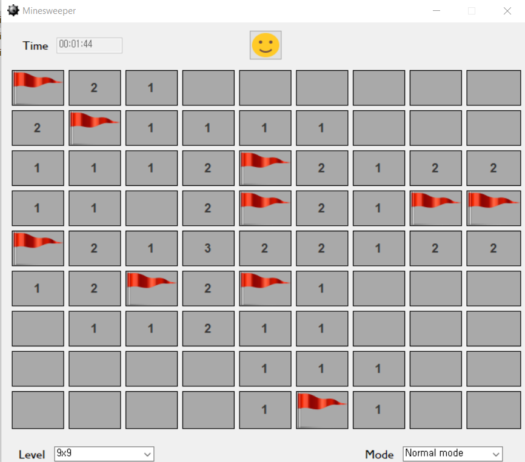
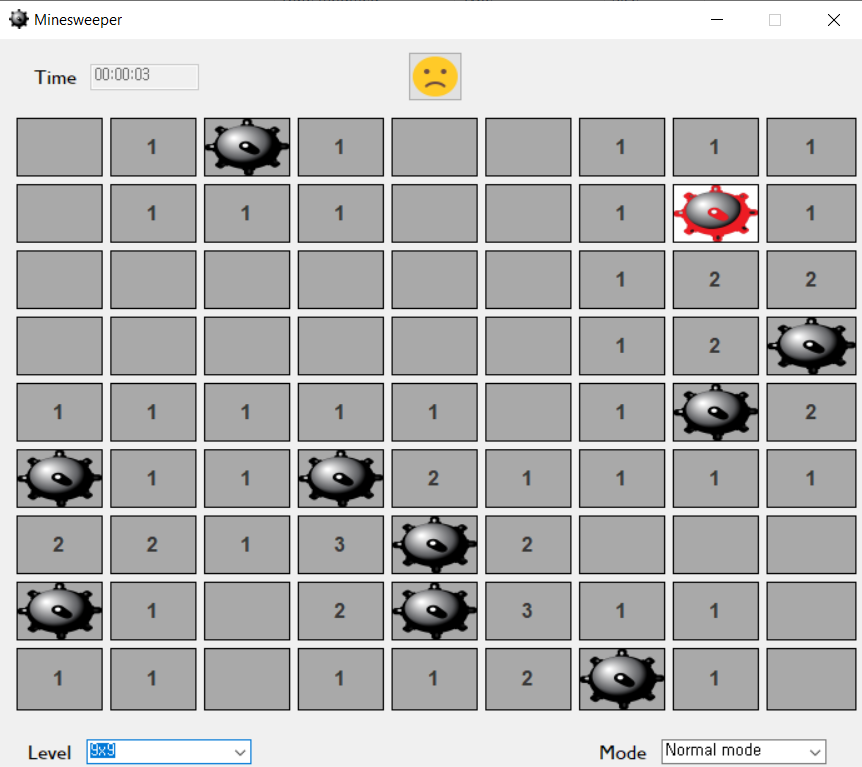
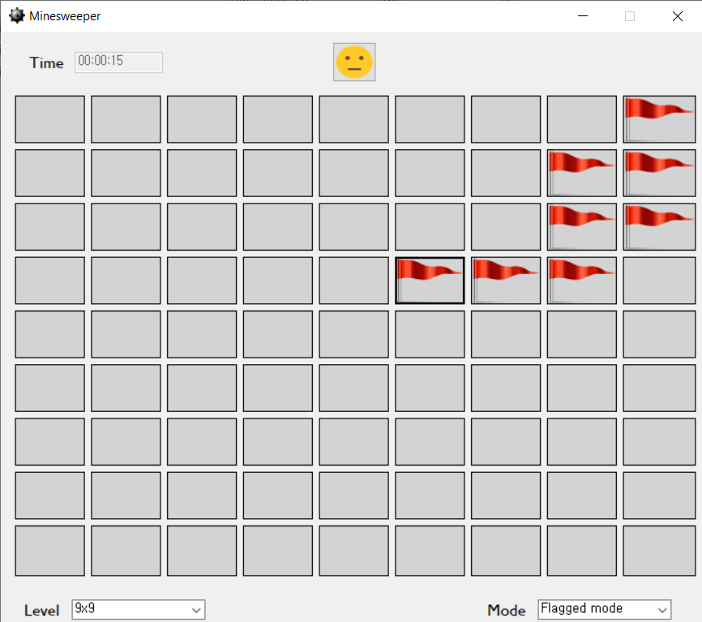

# Minesweeper
C# clone of the classic Minesweeper

*Last updated: 04/04/2022 - 23:30 (KST)*
## How to play
There are 2 ways to run the game:
- Build & run with Microsoft Visual Studio 2019 using .NET Framework 4.7.2 (no additional dependencies required)
- Run the execution file directly which is located at Resources/Minesweeper.exe
## Demo 

## Done
- Generate new game with 3 levels (select using the combo box at bottom left):
  - 9x9 field with 10 mines (Easy) - default mode
  - 16x16 fields with 40 mines (Medium)
  - 16x30 fields with 99 mines (Hard)
- Support 2 modes (select using the combo box at bottom right):
  - Normal mode: click to uncover cell
  - Flagged mode: click to put marking flag on cell
- Handle event when click on one cell (normal mode):
  - Display mine if the clicked cell is a mined cell and every cell will automatically be uncovered
  - Display a positive number which indicates the number of mines diagonally and/or adjacent to it
  - Display a blank cell and all adjacent non-mined cells will automatically be uncovered 
- Ensure the first clicked cell will never be a mined cell
- Finish game:
  - When the mined cell is clicked, all cells will be uncovered, the clicked mined cell will show a red mine, whereas each of other mined cells will show a black mine -> "Game over!"
  - When every unmined cell is uncovered, each mined cell will show a red flag -> "Victory!"
- Add mined cell icon & program icon
- Display timer on hh:mm:ss format
 ## To do
 - Find & fix potential bugs
 - Imrove performance
 - Improve GUI (?)
 - Add high score table
 ## Credit
 - Mine icon was downloaded from [pngwing](https://www.pngwing.com/en/free-png-cbukd)
 - Red flag icon was downloaded from [clipartmax](https://www.clipartmax.com/middle/m2i8i8d3H7N4N4A0_red-flag-icon-psd-red-flag-icon-transparent-background/)
 - Blurring-related classes (Util.cs) is based on [ua.Skywalker solution](https://stackoverflow.com/a/3599954/5445721) (not used yet in the current version)

